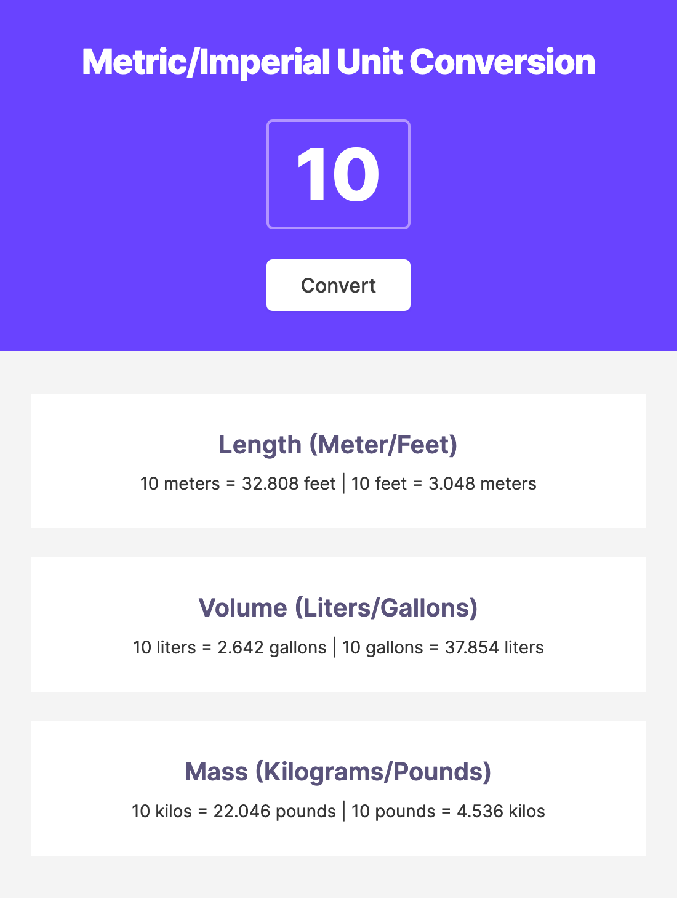
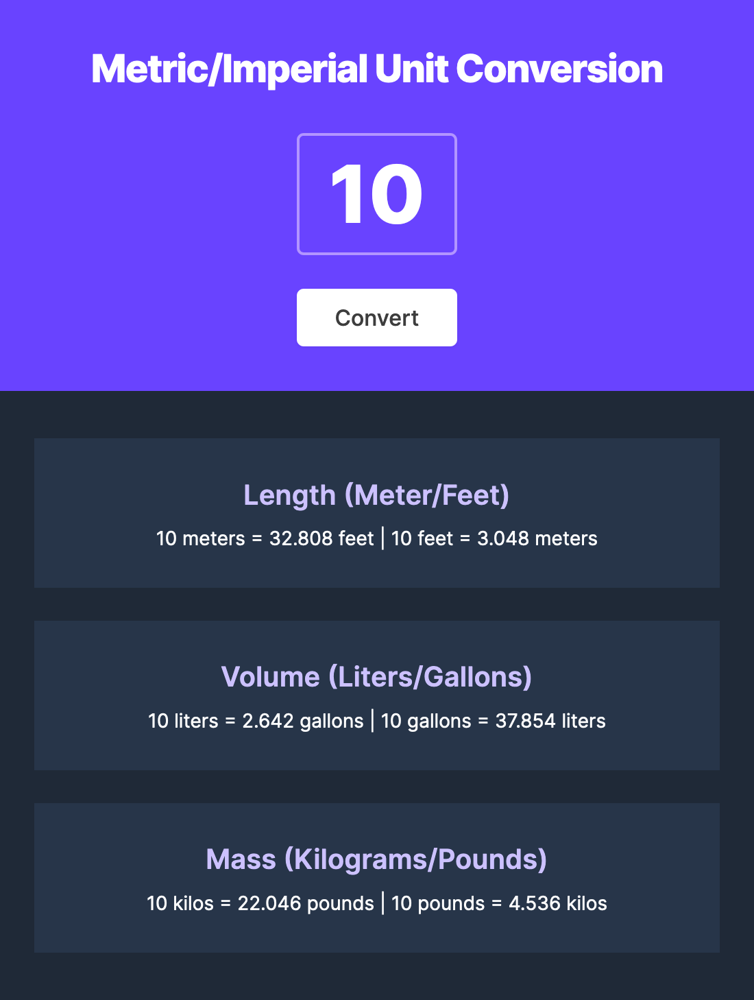

# Unit Conversion

This is the Unit Conversion project in the Scrimba Frontend Developer Career Path.

## Table of contents

-   [Overview](#overview)
    -   [The challenge](#the-challenge)
    -   [Stretch Goals](#stretch-goals)
    -   [Screenshots](#screenshots)
    -   [Links](#links)
-   [My process](#my-process)
    -   [Built with](#built-with)
    -   [What I learned](#what-i-learned)
    -   [Continued development](#continued-development)
    -   [Useful resources](#useful-resources)
-   [Author](#author)

## Overview

### The challenge

The challenge was to create a Unit Conversion app using a Figma design. The results are shown to users when they click the `Convert` button.

### Stretch Goals

I did the light and dark modes, and the app selects the correct one according to the system settings. I didn't give the user the option to change the themes on the website because I didn't want to mess with the design.

### Screenshots

### Links

-   Solution URL: <https://github.com/gdsimoes/scrimba-unit-converter/>
-   Live Site URL: <https://gdsimoes.github.io/scrimba-unit-converter/>

## My process

### Built with

-   Figma
-   Semantic HTML5 markup
-   CSS custom properties
-   Flexbox
-   JavaScript

### What I learned

This project was very straightforward, and I did it mainly as practice. The only thing that challenged me was how to get rid of the default arrows that show up inside `input` elements of type `number`.

### Continued development

I am becoming increasingly uncomfortable with my heavy use of the `calc` CSS function. For my following projects, I should stop using them so often.

### Useful resources

-   [MDN - min()](https://developer.mozilla.org/en-US/docs/Web/CSS/min) - For the first time, I had to dynamically use the minimum of two CSS lengths; this article showed how easy it is to get that.
-   [Stack Overflow - .toFixed()](https://stackoverflow.com/questions/11832914/how-to-round-to-at-most-2-decimal-places-if-necessary) - I asked Google how to round a number to 3 decimal places and found the answer here.
-   [W3 Schools - Hide Arrows From Input Number](https://www.w3schools.com/howto/howto_css_hide_arrow_number.asp) - This article has a simple example, and it was all I needed.

## Author

-   Website - <https://gdsimoes.com>
-   LinkedIn - [Guilherme Dias Simoes](https://www.linkedin.com/in/gdsimoes)
